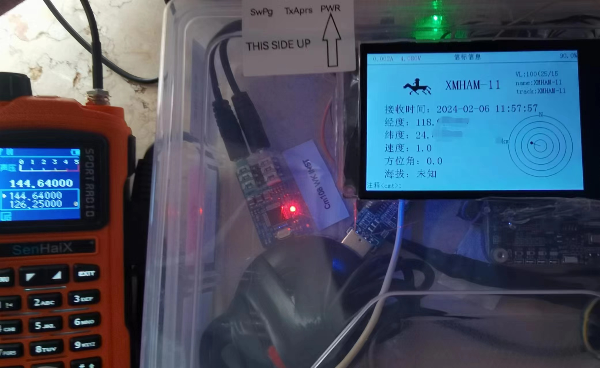
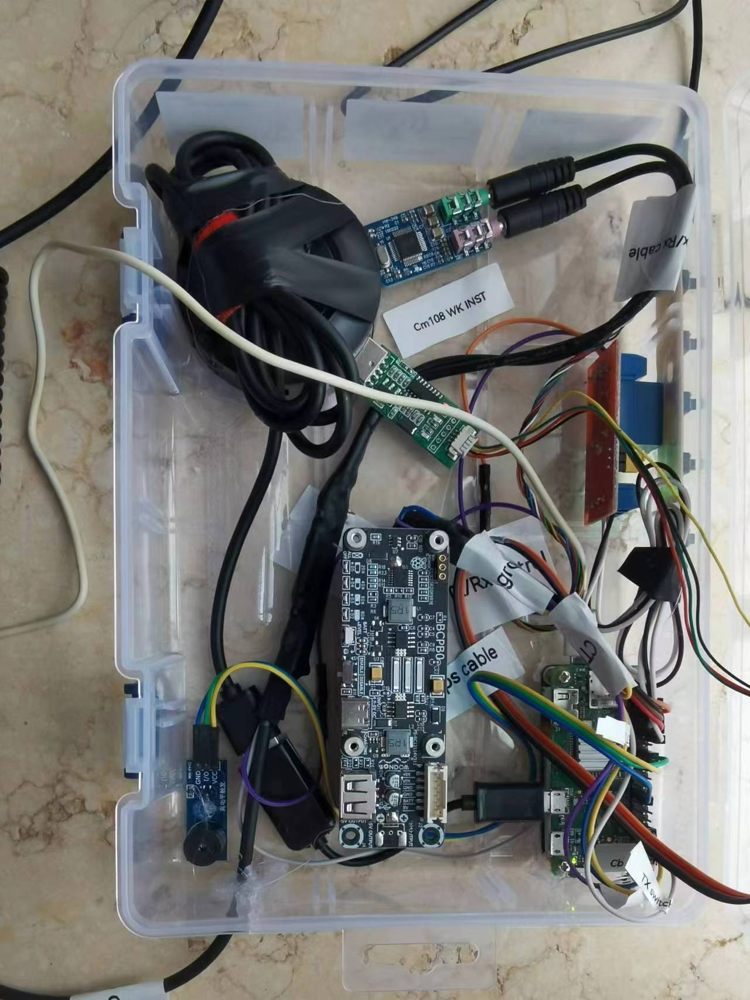

## PI-APRS
使用树莓派0+direwolf自动发送/解码aprs包的工具。
所需材料：
+ 一个串口屏。我用的是JC035-HVGA-ST-02-V02
+ 一个高电平触发的蜂鸣器
+ 3个按钮
+ 一个gps模块
+ 一个树莓派0的ups，我是用INA219
+ 一个3V继电器
+ 一个USB HUB
+ 一个CM108声卡
+ 两个3.5mm音频头
+ 树莓派ZERO W/2W
+ 一个K头线和转接板，我用的tb TDV的
+ 电烙铁、杜邦线等等

有空再继续写....

